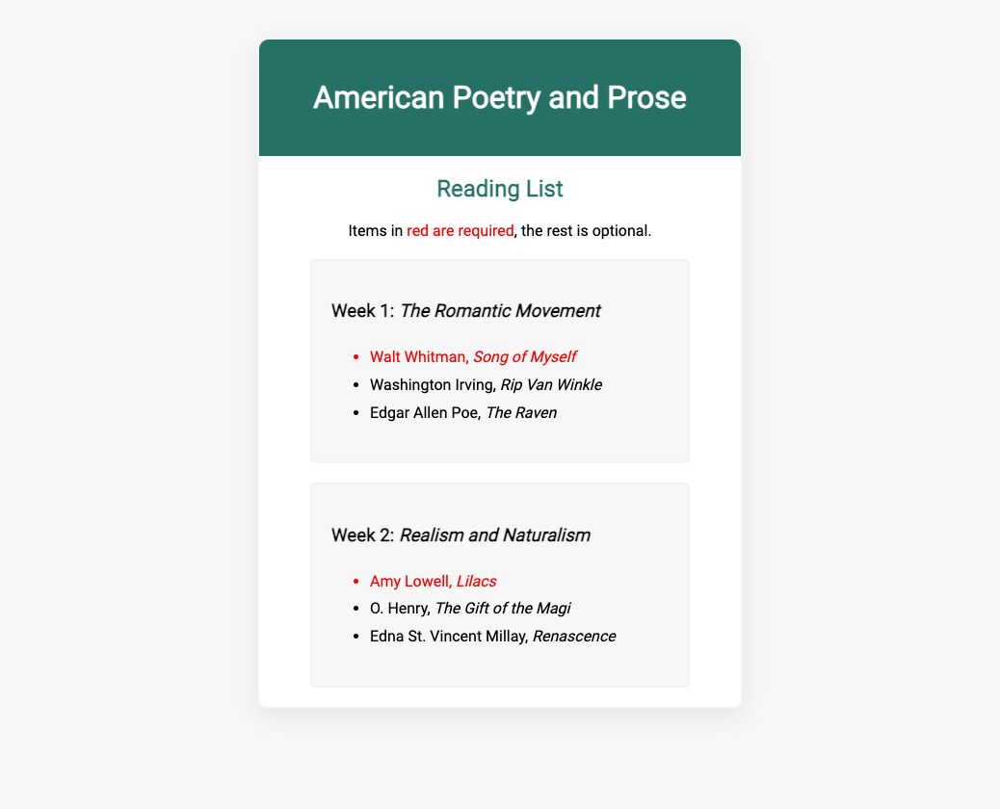

# Box Model Exercise
This exercise was designed to help you understand this week's content. It is not graded.
1. Clone this repository onto your local computer.
2. In VS Code, add embedded styles to the index.html file to make it look like the example below: 
 

  * Read through the HTML to understand how the content was structured.
  * Align all the text in the body HTML element to the center;
  * Give the main HTML element a white background colour and rounded corners (10px radius).
  * Give the main HTML element a shadow using the declaration below  
`{ box-shadow: rgba(149, 157, 165, 0.2) 0px 8px 24px; }`
  * The week 1 and week 2 reading lists are inside section HTML elements. Style the sections with:
      * A border that is 2px thick, solid in style and uses the following hexadecimal colour: #F3F3F3
      * Rounded corners with a 5px radius
      * A background colour of #F7F7F7
      * 20px of padding on all four sides
      * Align their text to the left
      * Restrict their width to 350px
      * Give their text a bit more vertical space by increasing its line height to 1.8rem
      * Set the horizontal margins to auto to horizontally center the element within its parent element, and set the vertical margins to 40px  

   * Style the main HTML element:
      * Read about margin collapse: https://www.smashingmagazine.com/2019/07/margins-in-css/. Give the main HTML element the same border as the section elements to make it respect its chidrens' vertical margins
      * Restrict its width to 500px;
      * Give it the same margins as the section elements

   * Style the header HTML element:
      * Give it a background colour of #257165
      * Change the colour of its text to white
      * Give it 20px of padding on all four sides
      * Round the top left and top right corners with a 10px radius
